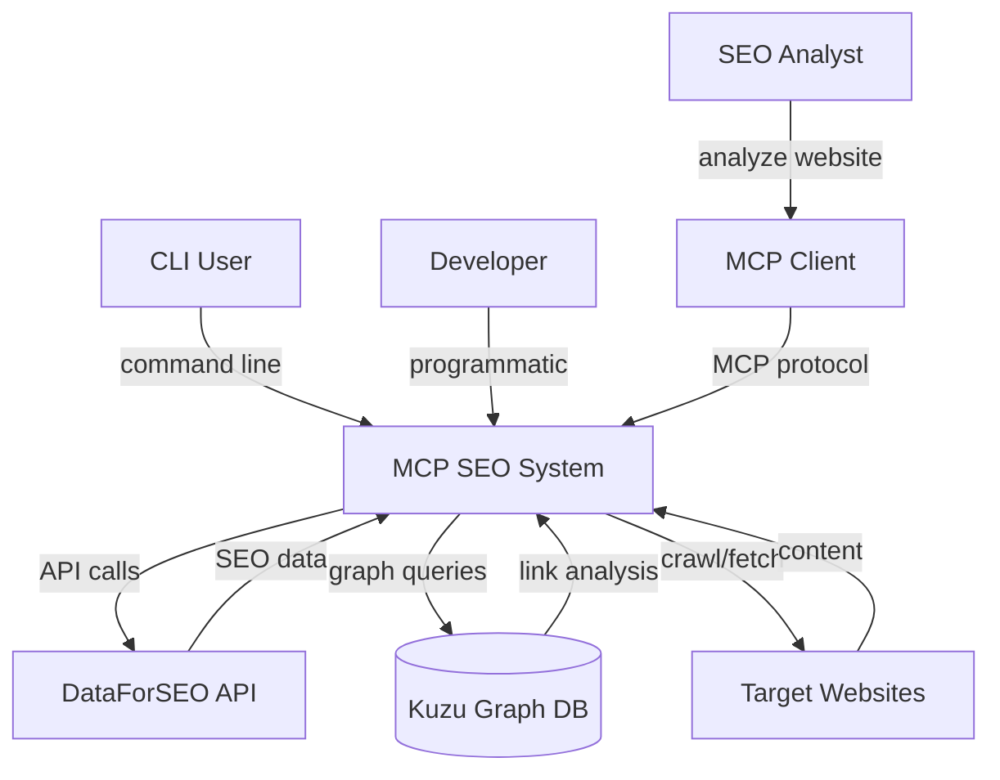
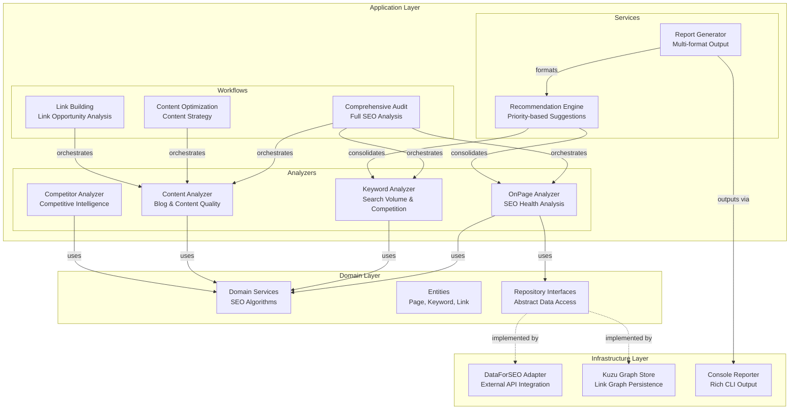
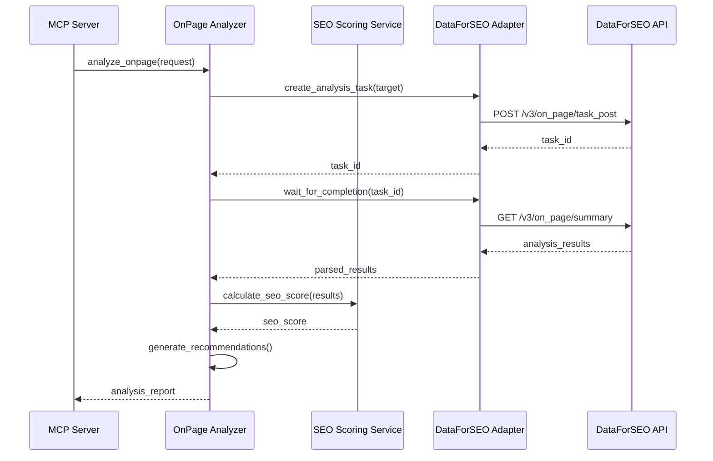
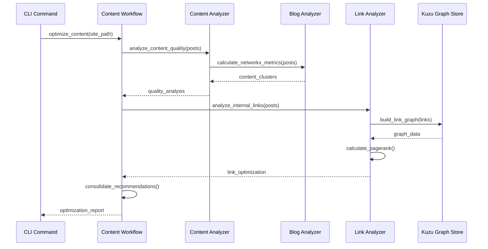
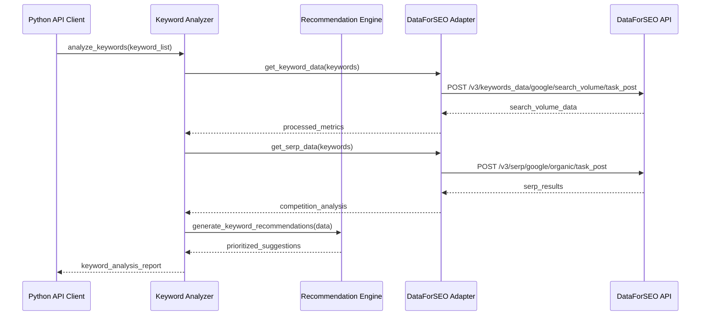
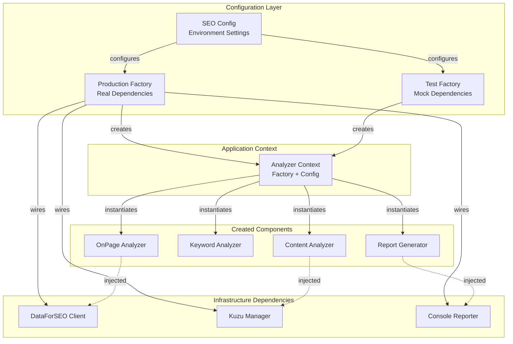
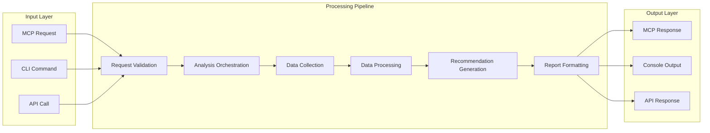
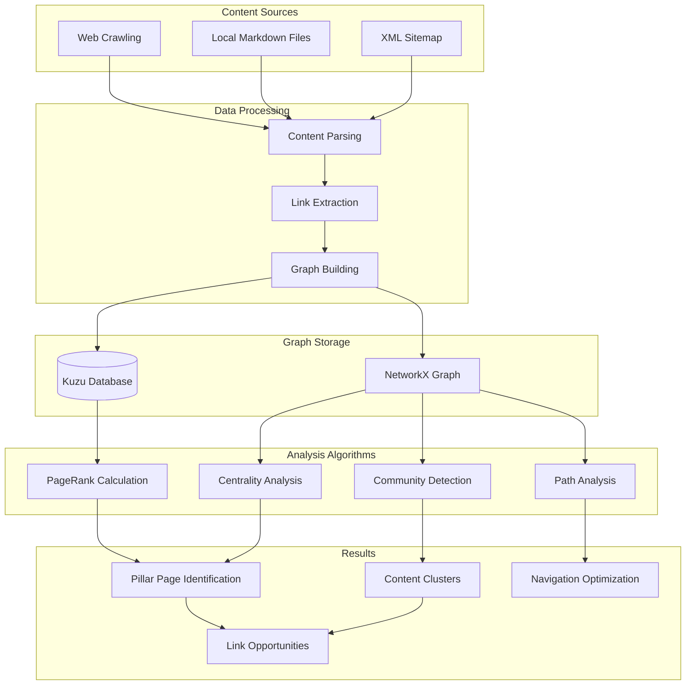

# Dependency Flow and Component Relationships

## System Context Diagram (C4 Level 1)



## Container Diagram (C4 Level 2)

```mermaid
graph TB
    subgraph "MCP SEO System"
        MCPServer[MCP Server<br/>FastMCP]
        CLIApp[CLI Application<br/>Click/Typer]
        APIClient[Python API Client<br/>Direct Usage]

        AppLayer[Application Layer<br/>Use Cases & Workflows]
        DomainLayer[Domain Layer<br/>Business Logic]
        InfraLayer[Infrastructure Layer<br/>External Integrations]
    end

    subgraph "External Systems"
        DataForSEO[DataForSEO API<br/>RESTful Service]
        KuzuDB[(Kuzu Database<br/>Graph Storage)]
        WebCrawler[Web Crawler<br/>Site Content)]
    end

    MCPServer -->|orchestrates| AppLayer
    CLIApp -->|orchestrates| AppLayer
    APIClient -->|orchestates| AppLayer

    AppLayer -->|uses| DomainLayer
    AppLayer -->|uses| InfraLayer

    InfraLayer -->|HTTP calls| DataForSEO
    InfraLayer -->|graph operations| KuzuDB
    InfraLayer -->|content fetching| WebCrawler
```

## Component Diagram (C4 Level 3) - Application Layer



## Dependency Flow by Feature

### OnPage Analysis Flow



### Content Analysis Flow



### Keyword Research Flow



## Factory and Dependency Injection Pattern



## Data Flow Architecture

### Analysis Request Processing



### Graph Analysis Data Flow



This dependency flow ensures:
- **Clear data flow** from input to output
- **Proper separation** of concerns across layers
- **Flexible component substitution** via dependency injection
- **Testable architecture** with well-defined boundaries
- **Scalable processing** with async/parallel capabilities